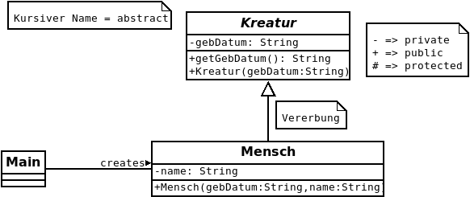
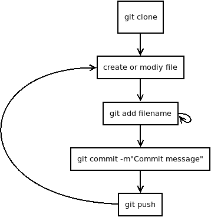
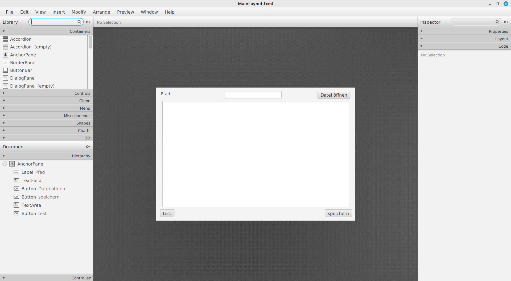
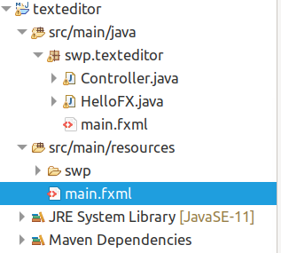

# SWPStoff

## Table of Contents

- [SWPStoff](#swpstoff)
  - [Table of Contents](#table-of-contents)
- [coding guidelines](#coding-guidelines)
  - [CamelCase](#camelcase)
- [String Formatierung mit `printf`](#string-formatierung-mit-printf)
- [Enums](#enums)
  - [switch-case Anweisung](#switch-case-anweisung)
- [forEach Schleife](#foreach-schleife)
- [Objektorientierte Programmierung](#objektorientierte-programmierung)
  - [Konstruktor](#konstruktor)
    - [Standardkonstruktor](#standardkonstruktor)
  - [toString() Methoden - Ausgabe eines Objektes](#tostring-methoden---ausgabe-eines-objektes)
  - [Sichtbarkeit](#sichtbarkeit)
  - [Kapselung](#kapselung)
  - [Überladen von Funktionen](#überladen-von-funktionen)
  - [Keyword *static*](#keyword-static)
  - [DRY - Don't Repeat Yourself](#dry---dont-repeat-yourself)
  - [ArrayList](#arraylist)
  - [Vererbung](#vererbung)
    - [*super*-Keyword](#super-keyword)
    - [Keyword *abstract*](#keyword-abstract)
    - [Annotation *@Override*](#annotation-override)
    - [instanceof - überprüfen der Klasse bzw. der Vaterklasse](#instanceof---überprüfen-der-klasse-bzw-der-vaterklasse)
    - [Interfaces - Schnittstellen](#interfaces---schnittstellen)
  - [UML - unified modeling language (class diagram)](#uml---unified-modeling-language-class-diagram)
- [Zufallszahlen (Random)](#zufallszahlen-random)
  - [Spieleprogrammierung mit Processing](#spieleprogrammierung-mit-processing)
  - [Thanks](#thanks)
    - [Thanks after DRY](#thanks-after-dry)
- [git basics](#git-basics)
    - [Ablaufdiagram eines typischen Workflows](#ablaufdiagram-eines-typischen-workflows)
    - [Ignorieren von Dateien](#ignorieren-von-dateien)
- [Exceptions](#exceptions)
  - [Ein ganzes Beispiel](#ein-ganzes-beispiel)
    - [Programm Argumente](#programm-argumente)
- [JavaFX](#javafx)
  - [Maven](#maven)
    - [Projekt Setup](#projekt-setup)
    - [Ausführen](#ausführen)
  - [SceneBuilder - JavaFX](#scenebuilder---javafx)
- [Bitflags](#bitflags)
- [Datenstrukturen](#datenstrukturen)
  - [Linked List](#linked-list)
  - [Doubly Linked List](#doubly-linked-list)
  - [ArrayList](#arraylist-1)
  - [Stack (LIFO) - Last In First Out](#stack-lifo---last-in-first-out)
  - [Queue (FIFO) - First In First Out](#queue-fifo---first-in-first-out)
- [Rekursion](#rekursion)
  - [Endrekursion](#endrekursion)
    - [Beispiel add bei FIFO - Queue](#beispiel-add-bei-fifo---queue)
- [Generics](#generics)
  - [Bounded Generics](#bounded-generics)
  - [Tests mit JUnit](#tests-mit-junit)


# coding guidelines

## CamelCase

Start abhängig von Typ, jedes weitere Wort groß.

```java
String firstName;
```

Alle Typen in CamelCase starten mit:

- Klassenname groß
- Eigenschaften klein
- Methoden klein
- Enum Groß (Werte alle UPPERCASE)

# String Formatierung mit `printf`

Alternativ zu der Ausgabe auf der Konsole zu ```println``` gibt es die Funktion ```printf```.
Sie ermöglicht das Schreiben eines kompletten Strings mit *Platzhaltern*.

```java
public void print() {
		System.out.println("Schüler: " + this.vName + " " + this.nName);
		System.out.printf("Schüler: %s %s", this.vName, this.nName);
	}
```

Auffällig sind die *Ersetzungsmarken* im String. In unserem Beispiel verwenden wir ```%s```, um
einen String auszugeben.

Die häufig verwendeten sind:

- %s String
- %d Integer
- %f Float / Double
- %n Newline -ersetzt \n

# Enums

Wird verwendet, um einen Datentyp zu erstellen, der nur die definierten Werte annehmen kann.

```java
// Definition
public enum HimmelsRichtung {
  NORDEN,
  OSTEN,
  SUEDEN,
  WESTEN
}

// Verwendung
public static void main(String[] args) {
  HimmelsRichtung hr = HimmelsRichtung.NORDEN;
}
```

Weiters können Enums mit zusätzlichen Attributen ergänzt werden.

```java
// in Datei Artikel.java
public enum Artikel {
  MAUS(324454),
  LAPTOP(4334);
  
  // wird verwendet um die Nummer des Enums zu speichern
  private int nummer;
  
  Artikel(int i) {
    nummer = i;
  }
  
  public int getNummer() {
    return this.nummer;
  }

  // falls wir einen Enum von einer Nummer erzeugen wollen können wir uns eine Funktion definieren
  public static Artikel fromNummer(int nummer) {
    switch (nummer) {
    case 324454:
      return MAUS;
    case 4334:
      return LAPTOP;
    default:
      return MAUS;
    }
  }
  
  public static void main(String[] args) {
    Artikel a = MAUS; // entspricht logisch: MAUS(324454)
    System.out.println(a.getNummer());
    
    Artikel a2 = LAPTOP; // entspricht logisch: LAPTOP(4334)
    System.out.println(a2.getNummer());

    Artikel a3 = Artikel.fromNummer(4334);
    System.out.println(a3);
  }
}
```

## switch-case Anweisung

Wird verwendet, um mögliche Fälle zu behandeln. Kann mit If-Abfragen ersetzt werden.

```java
public void printHimmelsRichtung(HimmelsRichtung hr) {
  switch (hr) {
    case NORDEN: System.out.println("Norden");break;
    case SUEDEN: System.out.println("Sueden");break;
    default: System.out.println("was anderes als Norden und Sueden");
  }
}

public void printHimmelsRichtungIf(HimmelsRichtung hr) {
  if (hr == NORDEN) {
    System.out.println("Norden");
  } else if (hr == SUEDEN) {
    System.out.println("Sueden");
  } else {
    System.out.println("was anderes als Norden und Sueden");
  }
}

public static void main(String[] args) {
  HimmelsRichtung hr = HimmelsRichtung.NORDEN;
  printHimmelsRichtung(hr);
  // prints: Norden
}
```

Falls das **break** vergessen wird, fällt die Auswertung durch => darunter liegende Code-Zeilen werden ausgeführt.

# forEach Schleife

Ist eine Kurzform der normalen for-Schleife und kann verwendet werden, wenn die Zählvariable (meist *i*) nicht gebraucht wird.

```java
// Tiere ist eine Klasse mit name als Attribut

public static void printHundeRasse(ArrayList<Tier> tiere) {
  for (Tier t : tiere) { // forEach loop
    System.out.println(t.getName());
  }

  // equivalent
  for (int i = 0; i < tiere.size(); i++) {
    Tier t = tiere.get(i); // normaler Array tiere[i]
    System.out.println(t.getName());
  }
}
```


# Objektorientierte Programmierung

Dient zur besseren Strukturierung von Programmen.
Durch Definieren eines "Bauplans", werden Eigenschaften und Funktionen eines Objektes definiert.

```java
// in Datein Person.java
class Person {
  // Eigenschaften/Attribute
  private String firstName;
  private String lastName;

  // Methoden (Funktionen der Klasse)
  public void printFirstName() {
    System.out.println(this.firstName);
  }

  // Konstruktor
  public Person(String firstName, String lastName) {
    this.firstName = firstName;
    this.lastName = lastName;
  }

  public static void main(String[] args) {
    // Erstellung eines Objektes vom Typ Person
    Person p = new Person("Sepp", "Huber");
  }
}
```

Klasse *Person* mit 2 Eigenschaften (firstName, lastName).

## Konstruktor

Wird verwendet, um eine Instanz einer Klasse zu erstellen. Die definierten Parameter des Konstruktors können verwendet werden, um die Eigenschaften des Objektes zu setzen.

### Standardkonstruktor

Falls kein anderer Konstruktor definiert ist, wird ein Standardkonstruktor erzeugt. Er hat keine Parameter und die Eigenschaften des Objektes entsprechen den Default-Werten.

```java
class Person {
  private String firstName; // Default für String = ""
  private boolean test; // Default für boolean = false

  // Default Konstruktor enspricht
  // public Person() {
  // }

  public static void main(String[] args) {
    // Verwendung des Default-Konstruktors
    Person p = new Person();
    // p.firstName entspricht ""
    // p.test entspricht false
  }
}
```

## toString() Methoden - Ausgabe eines Objektes

Wenn man versucht ein Objekt einer selbst-definierten Klasse auszugeben, wird man meist mit einer Ausgabe à la.
```Auto@677327b6``` überrascht. Um die Ausgabe zu verbessern, ist es möglich in der jeweiligen Klasse eine *toString()*-Methode zu erstellen, welche einen String zurück, welche das Objekt beschreibt.

```java
class Auto{
  private String marke;
  private int baujahr;

  public Auto(String marke, int baujahr){
    this.marke = marke;
    this.baujahr = baujahr;
  }

  @Override
  public String toString(){
    return "Auto: " + this.marke + " Baujahr: " + this.baujahr;
  }

  public static void main(String[] args) {
    Auto a = new Auto("Ford Escort", 1988);
    System.out.println(a); // gibt aus: Auto: Ford Escort Baujahr: 1988
  }
}
```


## Sichtbarkeit

Definiert, wer von wo auf das Element zugreifen kann.
Es gibt folgende Sichtbarkeiten:

- private --> nur in der gleichen Klasse sichtbar
- public --> von überall sichtbar
- (protected) --> sichtbar im gleichen Package und Subklassen
- default --> entspricht für uns derzeit protected

## Kapselung

Wird verwendet, um Eigenschaften einer Klasse mithilfe der Sichtbarkeit zu verbergen. Eigenschaften einer Klasse sind demnach meistens *privat*. Zugriff von Außen wird über Funktionen geregelt (Getter und Setter). Wenn diese angeboten werden, können von außen Werte ausgelesen bzw. gesetzt werden.

```java
class Person{
  // Eigenschaften privat
  private int age;

  // Getter von age
  public int getAge() {
    return this.age;
  }

  // Setter von age
  public void setAge(int val) {
    this.age = val;
  }
}

```

## Überladen von Funktionen

Funktionen und Konstruktoren dürfen den gleichen Namen haben, müssen sich aber über die Parameter unterscheiden. Nur das Ändern des Rückgabetyps reicht nicht.

```java
class Person{
  private int age;
  private String fname;

  // Konstruktor 1
  public Person() {
    this.age = 12;
    this.fname = "unbestimmt";
  }

  // Konstruktor 2
  public Person(int age) {
    this.age = age;
    this.fname = "Sepp";
  }

  // Konstruktor 3
  public Person(int age, String fname) {
    this.age = age;
    this.fname = fname;
  }

  public static void main(String[] args) {
    Person p1 = new Person(); 
    // Konstruktor 1 || age=12, fname="unbestimmt"
    Person p2 = new Person(18); 
    // Konstruktor 2 || age=18, fname="Sepp"
    Person p3 = new Person(17, "Martin"); 
    // Konstruktor 3 || age=17, fname="Martin"
  }

  // Funktoniert auch für normale Funktionen
  void ueTest() {
    System.out.println("test");
  }

  // ueberladen der Funktion
  void ueTest(int parameter) {
    System.out.println("test " + parameter);
  }

  // funktioniert nicht, weil Unterscheidung nur über Rückgabetyp, Parameter sind gleich wie vorhandene Funktion
  int ueTest(int parameter) {
    return 42;
  }
}
```

## Keyword *static*

Wird verwendet, um am "Bauplan" der Klasse, Funktionen und Eigenschaften zu definieren, welche ohne Objekt verwendet werden können. Alle Objekte der Klasse können auf statische Funktionen und Variablen zugreifen. Statische Variablen gibt es nur einmal (alle sehen den gleichen Wert).

```java
public class Person {

  private String name;

  private static int anzErstellt; // ist gültig für Bauplan und alle Objekte

  public static int getAnzErstellt() {
    return anzErstellt;
  }

  // Konstruktor: erhöht Anzahl erstellter Personen um 1
  Person() {
    anzErstellt++;
    this.name = "Sepp";
  }

  public String getName() {
    return this.name;
  }


  public static void main(String[] args) {
    Person martin = new Person();
    // hier ist anzErstellt == 1
    Person sepp = new Person();
    // hier ist anzErstellt == 2
    System.out.println(Person.getAnzErstellt()); // von Bauplan

    System.out.println(sepp.getName()); // von Objekt
  }

```

## DRY - Don't Repeat Yourself

Vermeide gleichen oder ähnlichen Code um Fehler zu vermeiden und den Code übersichtlicher und nachvollziehbarer zu gestalten.

```java
// import java.util.Random;
// import java.util.Arrays;

public static void einPaarZahlen(){
  Random rand = new Random();
  int ersteZahlen[] = new int[3];
  for (int i = 0; i < 3; i++) {
    ersteZahlen[i] = rand.nextInt(10);
  }
  int zweiteZahlen[] = new int[5];
  for (int i = 0; i < 5; i++) {
    zweiteZahlen[i] = rand.nextInt(10);
  }
  int dritteZahlen[] = new int[10];
  for (int i = 0; i < 10; i++) {
    dritteZahlen[i] = rand.nextInt(10);
  }
  // .. mache was mit den 3 Variablen ... zB:
  int sumOfArrays[] = new int[3];
  for (int i = 0; i < 3; i++) {
    int sum = 0;
    sum += ersteZahlen[i];
    sum += zweiteZahlen[i];
    sum += dritteZahlen[i];
    sumOfArrays[i] = sum;
  }
  System.out.println(Arrays.toString(sumOfArrays));
}

// nach dem DRY- Optimierung

private static int[] createRandomArray(int length){
  Random rand = new Random();
  int zahlenA[] = new int[length];
  for (int i = 0; i < length; i++) {
    zahlenA[i] = rand.nextInt(10);
  }
  return zahlenA;
}

public static void einPaarZahlen(){
  int ersteZahlen[] = createRandomArray(3);
  int zweiteZahlen[] = createRandomArray(5);
  int dritteZahlen[] = createRandomArray(10)
  // .. mache was mit den 3 Variablen ... zB:
  int sumOfArrays[] = new int[3];
  for (int i = 0; i < 3; i++) {
    int sum = 0;
    sum += ersteZahlen[i];
    sum += zweiteZahlen[i];
    sum += dritteZahlen[i];
    sumOfArrays[i] = sum;
  }
  System.out.println(Arrays.toString(sumOfArrays));
}
```

## ArrayList

Wird benötigt, um Arrays zu erzeugen, welche zur Laufzeit erweitert werden können. Wird auch als dynamischer Array bezeichnet. **Wichtig**: eine ArrayList kann nur Objektdatentypen (keine primitiven Datentypen) speichern. Java stellt für genau diesen Zweck *Wrapperklassen* zur Verfügung. *Integer* beinhaltet einen *int*, oder *Float* beinhaltet einen *float*, usw.

```java
import java.util.ArrayList;
import java.util.Scanner;

public class Main {
  public static void main(String[] args) {
    // Benutzer gibt beliebig viele Zahlen en
    // werden in Array gespeichert
    ArrayList<Integer> inputsArray = new ArrayList<Integer>();
    int input = 0;
    Scanner scan = new Scanner(System.in);
    while (input != -1) {
      input = scan.nextInt();
      inputsArray.add(input); // erweitern um eine Stelle
    }
    // hiert wird size() anstatt length verwendet
    for (int i = 0; i < inputsArray.size(); i++) {
      System.out.println(inputsArray.get(i));
    }
  }
}
```

weiteres Beispiel:

```java
import java.util.ArrayList;
import java.util.Scanner;

public class Main {
  public static void main(String[] args) {
    Scanner scan = new Scanner(System.in);
    ArrayList<String> al = new ArrayList<String>();
    String vorName = "";
    boolean cont = false;
    do {
      cont = false;
      vorName = scan.nextLine();
      if (!("".equals(vorName))) {
        al.add(vorName);
        cont = true;
      }
    } while ( cont == true );
    System.out.println(al);
    System.out.printf("Die Laenge der Arraylist %s is %d", al, al.size());
  }
}
```

## Vererbung

Wird verwendet um Code besser strukturieren zu können. Öfter verwendete Attribute und Methoden können in einer Klasse zusammengefasst werden, um Fehler zu vermeiden und dem *DRY*-Prinzip zu folgen.
Um von Klassen erben zu können, wird das keyword *extends* verwendet.

### *super*-Keyword

*super* ruft den Konstruktor der vererbten Klasse auf.
Falls eine Methode der Vaterklasse aufgerufen werden soll, obwohl die aktuelle Klasse die Methode überschrieben hat, kann man mit 

```java
super.methodenName(...)
```

die ursprüngliche Methode aufrufen.

```java
\\ in Tier.java
public abstract class Tier {
	
	private String name;
	private String gebTag;
	
	public String getName() {
		return name;
	}
	public String getGebTag() {
		return gebTag;
	}
	
	public Tier(String name, String gebTag) {
		this.name = name;
		this.gebTag = gebTag;
	}

  public String gibLaut(){
    return "tierGeräusch";
  }
}

\\in Hund.java
public class Hund extends Tier {
	
	private String rasse;
	
	public Hund(String name, String gebTag, String rasse) {
		super(name, gebTag); // Aufruf des Konstruktors der Vaterklasse
		this.rasse = rasse;
	}

	public String getRasse() {
		return rasse;
	}

  @Override
  public String gibLaut(){
    return "wuff";
  }

  public String gibLautVonVater(){
    return super.gibLaut();
  }
}

\\ in Main.java
public class Main {
  public static void main(String[] args) {
    Hund hund = new Hund("Hansi","1.1.2010","Pudel");
    hund.gibLaut(); // gibt aus: wuff
    hund.gibLautVonVater(); // gibt aus: tierGeräusch
  }
}

```

### Keyword *abstract*

Markiert die Klasse, dass sie nicht instanziiert werden kann(es kann kein Objekt dieser Klasse erzeugt werden).

### Annotation *@Override*

Steht über einer Funktion, welche überschrieben werden soll. Es kann auch ohne *@Override* überschrieben werden. *@Override* erstellt einen Vertrag, dass genau die Signatur der Funktion entsprechen muss. Ohne diesem Keyword, läuft man Gefahr, dass wenn die Signatur einer Methode der Vaterklasse sich verändert, ich die Methode nur überlade und nicht überschreibe.

```java
// Fahrzeug.java
// Erstellen einer Klasse welche vererbt werden soll. - abstract
public abstract class Fahrzeug {

	private int ps;
	private int baujahr;
	private double currentVelocity;
	
	public Fahrzeug(int ps, int baujahr) {
		this.ps = ps;
		this.baujahr = baujahr;
		this.currentVelocity = 0.0;
	}
	
	public void accelerate() {
		this.currentVelocity += this.ps/10.0;
	}

	public int getPs() {
		return ps;
	}

	public int getBaujahr() {
		return baujahr;
	}

	public double getCurrentVelocity() {
		return currentVelocity;
	}
	
	protected void setCurrentVelocity(double v) {
		this.currentVelocity = v;
	}
}

// Auto.java
// Subklasse (Klasse die von Vaterklasse erbt)
public class Auto extends Fahrzeug{
	
	private String marke;

	public Auto(int ps, int baujahr, String marke) {
		super(ps, baujahr);
		this.marke = marke;
	}

	public String getMarke() {
		return marke;
	}
}

// Traktor.java
// erbt ebenfalls von Fahrzeug
public class Traktor extends Fahrzeug {
	private double zugKraft;
	
	public Traktor(int ps, int baujahr, double zugKraft) {
		super(ps, baujahr);
		this.zugKraft = zugKraft;
	}

	public double getZugKraft() {
		return zugKraft;
	}
	
	@Override
	public void accelerate() {
		this.setCurrentVelocity( this.getCurrentVelocity() + this.getPs()/40.0);
//		this.currentVelocity += this.getPs()/40.0;
	}

}

```

### instanceof - überprüfen der Klasse bzw. der Vaterklasse

Wird verwendet, um während der Laufzeit zu überprüfen ob, das Objekt in eine bestimmte Klasse ***gecastet*** werden kann, also ob die Klasse des Objekts dem gecasteten entspricht bzw. in der Vererbungshirarchie anzutreffen ist.

```java
// in Tier.java
public abstract class Tier{
  protected String name;
  protected String geburtsDatum;

  public getGeburtsDatum() { 
    return this.geburtsDatum; 
  }

  public String getName(){
    return this.name;
  }

  public Tier(String name, String geburtsDatum){
    this.name = name;
    this.geburtsDatum = geburtsDatum;
  }
}

// in Hund.java
public class Hund extends Tier{
  private String rasse;

  public String getRasse(){
    return this.rasse;
  }

  public Hund(String name, String geburtsDatum, String rasse){
    super(name, geburtsDatum);
    this.rasse = rasse;
  }
}

// in Katze.java
public class Katze extends Tier{

  public Katze(String name, String geburtsDatum){
    super(name, geburtsDatum);
  }
}

// in Klasse Main.java
import java.util.ArrayList;

public class Main {

	public static void printHundeRasse(ArrayList<Tier> tiere) {
		for (Tier t : tiere) { // forEach loop
			if (t instanceof Hund) {
				Hund h = (Hund) t; // cast (umwandlung) zu Hund
				System.out.println(h.getRasse());
			} else {
				System.out.println("leider keine Rasse vorhanden (kein Hund)");
			}
		}

		// alternative 
		for (int i = 0; i < tiere.size(); i++) {
			Tier t = tiere.get(i);
			if (t instanceof Hund) {
				Hund h = (Hund) t; // cast (umwandlung) zu Hund
				System.out.println(h.getRasse());
			} else {
				System.out.println("leider keine Rasse vorhanden (kein Hund)");
			}
		}
	}

	public static void main(String[] args) {
		ArrayList<Katze> katzen = new ArrayList<Katze>();
		Katze schmusi = new Katze("Schmusi", "10.10.2010");
		katzen.add(schmusi);

		ArrayList<Hund> hunde = new ArrayList<Hund>();
		Hund kratzi = new Hund("Kratzi", "10.10.2010", "Rotweiler");
		hunde.add(kratzi);

		ArrayList<Tier> tiere = new ArrayList<Tier>();

		tiere.add(schmusi);
		tiere.add(kratzi);

		System.out.println(tiere);

		// geht nicht = abstract
//		Tier t = new Tier("tiere=i", "1.1.1111");

		printHundeRasse(tiere);

		kratzi.getRasse();

	}

}
```

### Interfaces - Schnittstellen

Durch die "Einschränkung", dass Java keine Mehrfachvererbung erlaubt, anders als andere Sprachen wie zb. C++, bedient sich Java eines Konzepts namens Interfaces. Diese dienen der Beschreibung was die Klasse erfüllen muss. Daher wird im Interface definiert, dass bestimmte Methoden überschrieben werden müssen. Es können beliebig viele Interfaces implementiert (nicht extended - wie bei (abstrakten) Klassen) werden.

Interfaces könnte man als Verträge verstehen, welche implementierende Klassen erfüllen.

## UML - unified modeling language (class diagram)

Wird verwendet um eine einheitliche "Sprache" zu definieren, welche uns erlaubt programmiersprachenunabhängig Klassen und ihre Beziehungen zu beschreiben.



Hier wird eine abstrakte Klasse Kreatur definiert. Die Klasse Mensch erbt von ihr und die Klasse mein erzeugt ein Objekt der Klasse Mensch.

# Zufallszahlen (Random)

Können von System generiert werden, es gibt mehrere Möglichkeiten, diese zu erzeugen.

```java
import java.util.Random; // wichtig

public class Main {
  public static void main(String[] args) {
    // Erstellen eines int
    Random rand = new Random();
    int randomZahl = rand.nextInt(10); // Zahl zwischen 0 und 10 exclusive
    
    Random rand = new Random();
    int bound = 1000; // wie weit - exclusive dieser Zahl
    int randomZahl = rand.nextInt(bound) + 10;
    System.out.println(randomZahl); // Zahl zwischen 10 - 1010 exclusive
    
    double randDouble = rand.nextDouble();
    System.out.println(randDouble); // Zahl zwischen 0.0 und 1.0 exclusive 
    
    // Ziel ist es einen Double von 10.0 - 20.0 zu machen
    int randomZahl2 = rand.nextInt(9) + 10;
    double randDouble2 = rand.nextDouble();
    double res = randDouble2 + randomZahl2;
    System.out.println(res);
    
    // Alternative
    double randDouble3 = rand.nextDouble()*10.0 + 10.0;
    System.out.println(randDouble3);
  }
}
```

## Spieleprogrammierung mit Processing

erstes Spiel ... Pong (start)

```java
 int posX = 0;
 int posY = 0;
 int accX = 1;
 int accY = 1;
 int accSpeed = 5;
 
void setup() {
  size(640, 360); 
  noStroke();
  rectMode(CENTER);
}

void draw() {

  fill(255, 204);
  
  if (posX > 640) {
   accX = -accSpeed; 
  }
  if (posX <= 0) {
   accX = +accSpeed; 
  }
  if (posY > 360) {
   accY = -accSpeed; 
  }
  if (posY <= 0) {
   accY = +accSpeed; 
  }
  
  posX = posX + accX;
  posY = posY + accY;
  circle(posX, posY, 10);
}
```

## Thanks

```java
float x = 50;
float y = 50;
float angle = 45;
float force = 100;
boolean shooting = false; // indicator if ball is in the air
int startTime = 0; // start time of fire
float g = 9.81; // gravity

void setup() {
  size(640, 360);
  noStroke();
  background(0);
}

float getVxt(float angle) {
  return force * cos(radians(angle));
}

float getVyt(float angle, float t) {
  return -g*t + force * sin(radians(angle));
}

float getX(float t, float x0, float angle){
  return getVxt(angle)*t+x0;
}

float getY(float t, float y0, float angle){
  return -g/2 * t*t + getVyt(angle,t)*t + y0;
}

void keyPressed() {
  if (key == 'd') {
    angle += 3;
  } else if (key == 'a') {
    angle -= 3;
  } else if (keyCode == RIGHT) {
    x += 3;
  } else if (keyCode == LEFT) {
    x -= 3;
  } else if (key == 'w') {
    force += 10;
  }else if (key == 's') {
    force -= 10;
  } else if (key == ' ') {
    shooting = true;
    startTime = millis();
  }
}

void draw() {
  background(0);
  color(128);
  scale(1, -1);
  translate(0, -height);
  rectMode(CENTER);
  rect(x, y, 30, 30);
  stroke(128);
  float lineEndX = acos(radians(angle))*100+x+15;
  float lineEndY = asin(radians(angle))*100+y+15;
  println(angle,lineEndX, lineEndY);
  line(x+15,y+15,lineEndX,lineEndY);
  
  text(force,width-100, height-100);
  
  if (shooting) {
    float deltaT = millis() - startTime;
    float newX = getX(deltaT/1000.0,x,angle);
    float newY = getY(deltaT/1000.0,y,angle);
    println("newX", newX, deltaT, angle, newY);
    circle(newX,newY,30);
  }
}
```

### Thanks after DRY

```java
// main
Tank tank1 = new Tank(50, 50);
Tank tank2 = new Tank(400, 50);
Tank currentTank = tank1;
Bullet bullet;

void setup() {
  size(640, 360);
  noStroke();
  background(0);
}

Tank getOtherTank(){
  if (currentTank == tank1) {
    return tank2;
  } else {
    return tank1;
  }
}

void switchTank() {
  if (currentTank == tank1) {
    currentTank = tank2;
  } else {
    currentTank = tank1;
  }
}

void keyPressed() {
  if (key == 'd') {
    currentTank.angle += 3;
  } else if (key == 'a') {
    currentTank.angle -= 3;
  } else if (keyCode == RIGHT) {
    currentTank.x += 3;
  } else if (keyCode == LEFT) {
    currentTank.x -= 3;
  } else if (key == 'w') {
    currentTank.force += 10;
  } else if (key == 's') {
    currentTank.force -= 10;
  } else if (key == ' ') {
    bullet = new Bullet(currentTank.angle, currentTank.force, currentTank.turretX, currentTank.turretY);
  }
}

void draw() {
  background(0);
  color(128);
  scale(1, -1);
  translate(0, -height);
  rectMode(CENTER);

  tank1.draw();
  tank2.draw();

  if (bullet != null) {
    bullet.draw();
  }
}

// Tank
class Tank {
  float x = 50;
  float y = 50;
  float angle = 45;
  float force = 100;
  final float width_ = 30;
  final float height_ = 30;
  float turretX = 0;
  float turretY = 0;

  Tank(float x, float y, float angle, float force) {
    this.x = x;
    this.y = y;
    this.angle = angle;
    this.force = force;
  }

  Tank(float x, float y) {
    this.x = x;
    this.y = y;
  }

  void draw() {
    rect(x, y, width_, height_);
    stroke(128);
    turretX = cos(radians(angle))*50+x;
    turretY = sin(radians(angle))*50+y;
    //println(angle, lineEndX, lineEndY);
    line(x, y, turretX, turretY);

    translate(0, height);
    scale(1, -1);
    textSize(60);
    text(force, x, height-300);
    scale(1, -1);
    translate(0, -height);
  }
}


// Bullet
class Bullet {
  int startTime = 0; // start time of fire
  final float g = 9.81; // gravity
  float angle = 0;
  float force = 0;
  float x0 = 0;
  float y0 = 0;
  float x = 0;
  float y = 0;
  float width_ = 15;

  Bullet(float angle, float force, float x0, float y0) {
    this.angle = angle;
    this.force = force;
    this.x0 = x0;
    this.y0 = y0;
    this.startTime = millis();
  }

  float getVxt(float angle) {
    return force * cos(radians(angle));
  }

  float getVyt(float angle, float t) {
    return -g*t + force * sin(radians(angle));
  }

  float getX(float t, float x0, float angle) {
    return getVxt(angle)*t+x0;
  }

  float getY(float t, float y0, float angle) {
    return -g/2 * t*t + getVyt(angle, t)*t + y0;
  }

  void draw() {
    float deltaT = millis() - startTime;
    x = getX(deltaT/1000.0, x0, angle);
    y = getY(deltaT/1000.0, y0, angle);
    //println("newX", x, deltaT, angle, y);
    circle(x, y, width_);
    Tank ot = getOtherTank();
    if ( ((x >= ot.x - ot.width_/2.0) && (x <= ot.x + ot.width_/2.0))
      && ((y >= ot.y - ot.height_/2.0) && (y <= ot.y + ot.height_/2.0)) ) {
      println("hit");
      exit();
      bullet = null;
      switchTank();
    }

    if ( x > 655 || x <-width_ / 2.0 || y < -width_ / 2.0 ) {
      bullet = null;
      switchTank();
    }
  }
}
  
```

# git basics

git ist ein Versionsverwaltungssystem, welches uns erlaubt verschiedene Versionen nachvollziehbar zu speichern und es erlaubt uns einfaches Zusammenarbeiten mit anderen Mitarbeitern.

Es existiert (normalerweise) ein `remote` repository auf zb. Github und ein `lokales` auf unserer Festplatte.

Wenn wir ein Repository angelegt haben (zb. auf Github) können wir es mit:

```git clone https://github.com/username/repositoryName``` 

auf unser System clonen.

**Wir müssen uns im git Verzeichnis befinden um folgende Befehle ausführen zu können.**

mit `git add dateiname.endung` können wir Dateien zu den "beobachtenden" Dateien hinzufügen.

mit `git commit -m"nachricht welche in de Logs erscheint"` erzeuge ich einen neuen *Busstop* welcher wie eine Version der Codebasis angesehen werden kann.

Durch `git push` werden die Änderungen meines Repostitories auf das `remote` Repository übertragen.

Um Änderungen von `remote` Repository in mein System zu holen, wir der Befehl `git pull` verwendet.

Jederzeit kann ```git status``` verwendet werden um den aktuellen Status des Repositories abzufragen.

### Ablaufdiagram eines typischen Workflows



### Ignorieren von Dateien

um nicht benötigte Dateien (zB. Dateien, welche beim compilieren erzeugt werden) zu ignorieren können wir im Hauptverzeichnis die Datei *.gitignore* erzeugen/editieren.

```
**.class
```

ignoriert alle *.class* Dateien.

# Exceptions

Exception entsprechen Ausnahmen, auf die der Benutzer reagieren kann.
Viele kennen eine der folgenden: *ArrayOutOfBoundsException* oder *NullPointerException*.
Diese Ausnahmen können entweder mit:

- try/catch
- throws 

behandelt werden. Mit try/catch werden die Programmzeilen, welche
eine Exception werden können in einen Block eingeschlossen.

```java
FileWriter writer = null;
try {
	writer = new FileWriter("myFile.txt");
	writer.write(myString);
	writer.close();
	System.out.println("Successfully wrote to the file.");
} catch (IOException e) {
	System.out.println("Da ist etwas schief gelaufen.");
}
```

hier kann auf den Fehler direkt reagiert werden.
Falls die Aufgabe des Fehlerbehandelns abgegeben werden soll, kann man 
die Exception an die aufrufende Funktion weiterreichen --> *throws*

```java
private static void writeToFile(String what) throws IOException {
	FileWriter writer = null;
	writer = new FileWriter("myFile.txt");
	writer.write(what);
	writer.close();
	System.out.println("huhu");
}
```

Exceptions erben von *Throwable*, welche eine Vaterklasse von *Error* und
*Exception* ist. *Error* definiert Fehler, auf die nicht reagiert werden kann/soll.

Man kann Exception einfach als Klasse definieren:

```java
// in class ToExpensiveException
public class ToExpensiveException extends Exception {

}
```

diese kann dann wie folgt verwendet werden:

```java
public static void throwMeMaybeAnException(int price) throws ToExpensiveException {
		if (price > 10) {
			throw new ToExpensiveException(); // hier wird die Exception erzeugt und geworfen
		}
	}
```

## Ein ganzes Beispiel

```java
// in ToExpensiveException.java
public class ToExpensiveException extends Exception {

}

```

```java
import java.io.FileWriter;
import java.io.IOException;

public class Main {
	
	public static void throwMeMaybeAnException(int price) throws ToExpensiveException {
		if (price > 10) {
			throw new ToExpensiveException();
		}
	}
	
	private static void writeToFile(String what) throws IOException {
		FileWriter writer = null;
		writer = new FileWriter("myFile.txt");
		writer.write(what);
		writer.close();
		System.out.println("huhu");
	}
	
	public static void main(String[] args) throws IOException {
		String myString = "Hello, world!";
		// Variante try catch
		FileWriter writer = null;
		try {
			writer = new FileWriter("myFile.txt");
			writer.write(myString);
			writer.close();
			System.out.println("Successfully wrote to the file.");
		} catch (IOException e) {
			System.out.println("Da ist etwas schief gelaufen.");
		}
		
		// Behandlung des Fehlers
		try {
			throwMeMaybeAnException(11);
			System.out.println("Yeah I have something to eat");
		} catch (ToExpensiveException e) {
			System.out.println("Sorry inflation!");
		}
		
		try {
			writeToFile("Servas");
		} catch (IOException e) {
			System.out.println("sorry my friend");
		}
		
	}

}
```

### Programm Argumente

Um unser Programm von außen steuern zu können, gibt uns Java(und sogut wie alle anderen Programmiersprachen)
die Möglichkeit Argument dem Programm beim Start zu übergeben.
Die passiert über die *main*-Methode mit den Argument *String[] args*.
Argumente können in Eclipse unter *Run Configurations...* unter *Java Applications* richtiges Programm wählen *Arguments*.
Die Argumente müssen bei Bedarf in den richtigen Datentyp konvertiert werden.
Im folgenden Beispiel wird ein *int* von einem String konvertiert.

```java
public class Main {
	public static void main(String[] args) {
		int sum = 0;
		for (String s : args) {
			try {
				int intValue = Integer.parseInt(s); // can throw NumberFormatException
				sum += intValue;
			} catch (NumberFormatException e) {
				System.out.println("Not a number in argument");
			}
		}
		System.out.println("Sum of all arguments: " + sum);
	}

}
```

# JavaFX

Um Benutzern mehr Komfort zu bieten werden meist Programm-Interaktionen mit GUIs (Graphical User Interfaces) gelöst.
Java bietet mehrere Möglichkeiten (SWT, AWT, JFace, ...), aber JavaFX wurde gewählt, da es die modernsten Oberflächen
bauen kann.

Um JavaFX verwenden zu können, müssen wir zusätzliche Bibliotheken installieren. Wir können entweder Bibliotheken selber 
herunterladen und sie in unseren Projekten dem Build-Path hinzufügen, oder wir verwenden folgende Methode.

## Maven

Maven ist ein Paketmanager für die Programmiersprache Java. Er dient dazu Bibliotheken zentral verfügbar zu machen und
Abhängigkeiten unserer Programme leichter definieren zu können. Daher können wir in einer Textdatei (pom.xml) eintragen, von
welchen Bibliotheken unser Programm abhängt. Maven erledigt dann alle schritte welche sonst von Hand nötig wären:

- herunterladen der Dateien
- eintragen der Bibliotheken im Build-Path

Durch dieses System, können wir also in einer einfachen Textdatei, welche wir auch in unser Versionsverwaltungssystem(git) eintragen können,
alle Abhängigkeiten einfach definieren. Wenn wir uns an einem anderen Computer befinden, übernimmt Maven wieder den Download und weitere
Schritte damit wir direkt weiterarbeiten können. 

Um Maven zu installieren, wählen wir die einfache Variante und verwenden [Eclipse IDE for Enterprise Java and Web Developers](https://www.eclipse.org/downloads/packages/release/2023-03/r/eclipse-ide-enterprise-java-and-web-developers)

### Projekt Setup

Um ein Maven Projekt zu erzeugen, wählen *Neues Maven Projekt*, im folgenden Screen einfach next und bei Filter geben wir `javafx` ein. Wir wählen in der List darunter dann das Element `com.gluonhq`-`gluonfx-archetype-javafx` mit der Version 0.0.3.
Im folgenden Fenster geben wir unter `Group ID` den gewünschten Paketnamen an und unter `Artifact Id` den gewünschten Projektnamen. 
Nach `Finish` und einem Enter im Consolenfenster indem `Y: : ` steht, sollten wir auf der linken Seite das neue Projekt sehen.

### Ausführen 

Um das Maven Projekt zu starten, gehen wir über das Projektkontextmenü unter `Run As` -> `Maven build`. Darin schreiben wir unter Goals: `clean javafx:run` 

## SceneBuilder - JavaFX

Um da Programm besser aufteilen zu können, und Fehler zu vermeiden werden wird das MVC (Model, View, Controller)- Muster verwendet:

- Model: Datenspeicher des Programms 
- View: JavaFX GUI
- Controller: Klassen für das reagieren auf Ereignisse (zb. ActionEvent)

Um eine GUI mit JavaFX mit einem SceneBuilder erzeugen zu können, brauchen wir als erstes das Programm: 

[SceneBuilder download](https://gluonhq.com/products/scene-builder/#download)

Dieses Programm wird verwendet um die GUI "zusammen zu klicken". Das Layout (also das Ergebnis) wird in Form einer XML-Datei (.fxml) gespeichert.



Um die diese Scene verwenden zu können muss:

- Die fxml-Datei in den resources Folder gelegt werden:
  
- ergänzen der pom.xml unter `<dependencies>`um folgende Zeilen:
  
  ```xml
  <dependencies>
    ...
    <dependency>
        <groupId>org.openjfx</groupId>
        <artifactId>javafx-fxml</artifactId>
        <version>11.0.1</version>
    </dependency>
  </dependencies>
  ```

- ersetzen des `start` codes in der `HelloFx.java` mit folgenden Code:

  ```java
  public void start(Stage stage) {
    Parent root = null;
    try {
      root = FXMLLoader.load(getClass().getResource("main.fxml"));
    } catch (IOException e) {
      System.out.println("could not load main.fxml");
          
      e.printStackTrace();
    }
    Scene scene = new Scene(root, 640, 480);
    scene.getStylesheets().add(HelloFX.class.getResource("styles.css").toExternalForm());
    stage.setScene(scene);
    stage.show();
  }
  ```

Um auf Events reagieren zu können ... fbc...


# Bitflags

Werden häufig in C oder C++ Code effizient zu programmieren. Häufig in Kombination mit Microcontrollern um bestimmte Register zu setzen. In java wenig häufig verwerndet.

```java
import java.util.ArrayList;
import java.util.Scanner;

public class Main {
	public static void main(String[] args) {
		ArrayList<Integer> numbers = new ArrayList<>();
		ArrayList<Integer> fizz = new ArrayList<>();
		ArrayList<Integer> buzz = new ArrayList<>();
		ArrayList<Integer> fizzBuzz = new ArrayList<>();
		
		System.out.println("Zahl plz");
		Scanner scan = new Scanner(System.in);
		int to = scan.nextInt();
		
		System.out.println("Bitshift");
		int flag = 1 <<2;
		System.out.println(flag);
		
		if ((to & flag) > 0) {
			System.out.println("YES");
		}
		
		for (int i = 1; i <= to; i++) {
			
			int res = 0;
			int modFizz = i % 3;
			int modBuzz = i % 5;
			
			if (modFizz == 0) {
				res = 1;
			}
			
			if (modBuzz == 0) {
				res += 2;
			}
			
			if ((res & 3) == 0) {
				numbers.add(i);
			}
			
			if ((res & 1) == 1) {
				fizz.add(i);
			}
			if ((res & 2) == 2) {
				buzz.add(i);
			}
			
			if ((res & 3) == 3) {// 3 ist binaer 11{
				fizzBuzz.add(i);
			}

		}
		System.out.println("numbers: " + numbers);
		System.out.println("fizz: " + fizz);
		System.out.println("buzz: " + buzz);
		System.out.println("fizzBuzz: " + fizzBuzz);
	}
}
```

# Datenstrukturen

Datenstrukturen dienen dazu Daten abzuspeichern. Es gibt viele verschiedene mit jeweiligen Vor- und Nachteilen. Durch die richtige Wahl der Datenstruktur kann ein Programm viel schneller und effizienter laufen.

## Linked List

Eine der einfachsten Datenstrukturen ist die Linked List. Man kann sich eine Linked List wie eine Kette vorstellen, an die wir beliebig Glieder hinzufügen können. Das löschen eines Gliedes erfordert, dass das vorhergehende Element auf das nachfolgende (des zu löschenden Elements) umgegebogen werden muss.
Es wird jeweils eine Node in die Liste eingegügt, welche einen Wert und den Zeiger (next) auf das nächste Element besitzt. Die Liste beinhaltet immer einen Zeiger (head) welcher auf das erste Element zeigt. 
Von diesem Element werden alle Operationen ausgeführt.
Bei einer Linked List zeigt eine Node immer nur zu der nächsten Node.

Linked Lists werden sehr selten verwendet, dienen aber aber gute Basisi für weitere (kompliziertere) Datenstrukturen.

```java
public class Node {

	private int value;
	private Node next;

	public Node(int value) {
		this.value = value;
		// next is automatically null
	}

	public int getValue() {
		return value;
	}

	public void setValue(int value) {
		this.value = value;
	}

	public void setNext(Node next) {
		this.next = next;
	}

	public Node getNext() {
		return this.next;
	}
}
```

```java
public class MyLinkedList {
	
	private Node head;
	
	public void add(int value) {
		if (head == null) {
			head = new Node(value);
			return;
		}
		Node current = head;
		
		while (current.getNext() != null) {
			current = current.getNext();
		}
		// current is the last node without a next
		current.setNext(new Node(value));
	}
	
	public int get(int pos) {
		Node current = head;
		for( int i =0; i < pos; i++) {
			current = current.getNext();
		}
		return current.getValue();
	}
	
	public void del(int pos) {
		if (pos < 0) {
			throw new IndexOutOfBoundsException();
		}
		if (pos == 0) {
			head = head.getNext();
			return;
		}

    Node current = this.head;
    for (int i = 0; i < pos-1; i++) {
      if (current.getNext() == null) {
        throw new IndexOutOfBoundsException();
      }
      current = current.getNext();
    }
    // we are no on Node before the Node we want to delete
    current.setNext(current.getNext().getNext());
	}
}
```

## Doubly Linked List

Bei der Doubly Linked List wird der Node ein weiteres Attribut hinzugefügt - der Zeiger zur vorigen Node.
Das ermöglicht uns, dass wir uns nicht nur in eine Richtung bewegen können, sonderen auch zurück gehen können. Nachteil ist, dass mehr Daten (2x Pointer) pro Datenwert, den ich abspeichern will, gebraucht wird. Die Doubly Linked List hat zusätzlich zu dem *head*-Pointer auch einen *tail*-Pointer welcher uns das traversieren (durchgehen) der Daten von hinten ermöglicht.

```java
public class Node {

	private int value;
	private Node next;
  private Node prev;

	public Node(int value) {
		this.value = value;
		// next is automatically null
    // prev is automatically null
	}

	public int getValue() {
		return value;
	}

	public void setValue(int value) {
		this.value = value;
	}

	public void setNext(Node next) {
		this.next = next;
	}

	public Node getNext() {
		return this.next;
	}

  public void setPrev(Node prev) {
		this.prev = prev;
	}

	public Node getPrev() {
		return this.prev;
	}
}
```

```java
public class MyDoublyLinkedList {
	
	private Node head;
  private Node tail;
	
	public void add(int value) {
		if (head == null) {
			head = new Node(value);
      tail = head;
			return;
		}
		Node current = head;
		
		while (current.getNext() != null) {
			current = current.getNext();
		}
		// current is the last node without a next
		current.setNext(new Node(value));
    tail = current.getNext();
	}
	
	public int get(int pos) {
		Node current = head;
		for( int i =0; i < pos; i++) {
			current = current.getNext();
		}
		return current.getValue();
	}
	
	public void del(int pos) {
		if (pos < 0) {
			throw new IndexOutOfBoundsException();
		}
		if (pos == 0) {
			head = head.getNext();
			return;
		}

    Node current = this.head;
    for (int i = 0; i < pos-1; i++) {
      if (current.getNext() == null) {
        throw new IndexOutOfBoundsException();
      }
      current = current.getNext();
    }
    // we are no on Node before the Node we want to delete
    Node afterToDelte = current.getNext().getNext();
    current.setNext(afterToDelte);
    afterToDelte.setPrev(current);
	}
}
```

## ArrayList

Schon oft verwendet, bauen wir hier unsere eigene Variante. Im Grunde wird ein normaler Array als Datenspeicher verwendet und wenn die Größe nicht mehr ausreicht muss ein neuer (größerer) Array erzeugt werden und die Daten kopiert. Das alles bekommt der Benutzer nicht mit. Für ihn ist das ein Array der beliebig groß werden kann.

```java
public class MyArraylistInteger {
	int capacity = 8;
	int[] data = new int[capacity];
	int index = 0;

	public void add(int val) {
		if (index + 1 > capacity) {
			this.capacity *= 2;
			int[] data2 = new int[this.capacity];
			for (int i = 0; i < data.length; i++) {
				data2[i] = this.data[i];
			}
			this.data=data2;
		}
		this.data[index++] = val;
	}
	
	public int get(int index) {
		return this.data[index];
	}

	public int getCapacity() {
		return capacity;
	}

	public int getIndex() {
		return index;
	}

	public static void main(String[] args) {
		MyArraylistInteger mal = new MyArraylistInteger();
		mal.add(3);
		mal.add(7);
		mal.add(10);
		System.out.println(mal.get(2));
	}
}
```

## Stack (LIFO) - Last In First Out

Der Stack ist ähnlich einer LinkedList. Der Unterschied besteht darin dass Elemente immer vorne hinzugefügt werden. Sie werden auf den Stapel gelegt.
Diese Operation wird *push* genannt. Eine weitere Eigenheit des Stacks ist, dass nur das oberste (erste)- Element genommen werden kann (Operatin *pop*).
Im Prinzip können wir uns einen Stack wie eine LinkedList vorstellen, bei der neue Elemente immer an Position 0 eigefügt werden. Und wenn wir ein
Elemt *pop*en wird es wieder von Position 0 genommen.
Weiters kann beim Stapel das oberste Element angesehen (peek) werden.

```java
public class Node {

	private int value;
	private Node next;

	public Node(int value) {
		this.value = value;
	}

	public int getValue() {
		return value;
	}

	public void setValue(int value) {
		this.value = value;
	}

	public void setNext(Node next) {
		this.next = next;
	}

	public Node getNext() {
		return this.next;
	}
}
```

```java
public class MyStack {
	
	private Node head;
	
	public void push(int value) {
		if (head == null) {
			head = new Node(value);
			return;
		} else {
      Node n = new Node(value);
      n.setNext(head);
      this.head = n;
    }
	}
	
	public int peek() {
    if (head == null) {
			return -1;
		} else {
      return head.getValue();
	}
	
	public int pop() {
		if (head !== null) {
      int headVal = head.getValue();
			head = head.getNext();
			return headVal;
		} else {
      return -1;
    }
}
```

## Queue (FIFO) - First In First Out

Die Queue ist ähnlich einer LinkedList. Elemente werden immer hinten hinzugefügt (*add*). Und Elemente werden immer von vorne weggenommen (*poll/remove*). Gleich wie der Stack kann auch auf das erste Element geschaut werden (*peek*) ohne es zu entfernen.


```java
public class Node {

	private int value;
	private Node next;

	public Node(int value) {
		this.value = value;
	}

	public int getValue() {
		return value;
	}

	public void setValue(int value) {
		this.value = value;
	}

	public void setNext(Node next) {
		this.next = next;
	}

	public Node getNext() {
		return this.next;
	}
}
```

```java
public class MyQueue {
	
	private Node head;
	
	public void add(int value) {
		if (head == null) {
			head = new Node(value);
			return;
		}
		Node current = head;
		
		while (current.getNext() != null) {
			current = current.getNext();
		}
		// current is the last node without a next
		current.setNext(new Node(value));
	}
	
	public int peek() {
    if (head == null) {
			return -1;
		} else {
      return head.getValue();
	}
	
	public int poll() {
		if (head !== null) {
      int headVal = head.getValue();
			head = head.getNext();
			return headVal;
		} else {
      return -1;
    }
}
```

# Rekursion

Rekursion wird verwendet um eine bestimmte Art von Problemlösungen umzusetzen.
Rekursion besteht aus folgenden Teilen:

- Abbruchbedingung(en)
- Rekursionsvortschritt (Aufruf von sich selber mit angepassten Parametern)

```
IS coole isch bei da Rekursion - dass man lei in aufbau herausfinden muss und die rekursion ääähh das Ergebnis selber rausfindet.
```
```
Das Faszinierende an der Rekursion ist, dass man lediglich den Aufbau verstehen muss, und die Rekursion findet dann das Ergebnis eigenständig heraus."
```

```java
// Berechnung Fakultät: 5! = 5 x 4 x 3 x 2 x 1
public static int faculty(int i){
  // Abbruchbedingung
  if (i == 0 || i == 1) {
    return 1;
  }
  // Recursionsvortschritt
  return i*faculty(i-1);
}

// Berechnung Paskalsches Dreieck siehe https://de.wikipedia.org/wiki/Pascalsches_Dreieck
public static int pasD(int zeile, int spalte){
  // Abbruchbedingung
  if (zeile == spalte || spalte == 0 ){
    return 1;
  } 
  // Recursionsvortschritt
  return pasD(zeile - 1, spalte) + pasD(zeile - 1, spalte -1);
}
```

## Endrekursion

Recursionsergebnis wird in Aufrufen "mitgeschliffen" - Das Ergebnis ist falls die Abbruchbedingung zutrifft verfügbar. Funktionale Sprachen optimieren oft auf Endrekursion.

```java
// public facing (Diese Funktion wird von Benutzern verwendet)
public static int fac(int val){
  return this.facEndRec(val, 1);
}

// Nur zur internen Verwendung bestimmt.
private static int facEndRec(int val, int result){
  if (val == 0){
    return result;
  }
  return facEndRec(val-1,val*result);
}
```

### Beispiel add bei FIFO - Queue

```java
public class RecQueue {
  private Node head;

  public void add(int value) {
    this.addInternal(value, this.head);
  }

  private void addInternal(int value, Node n) {
    if (n == null) {
      this.head = new Node(value);
      return;
    }
    if (n.next == null) {
      n.next = new Node(value);
      return;
    }
    addInternal(value, n.next);
  }

  public void print() {
    Node c = this.head;
    while (c.next != null) {
      System.out.println(c.value);
      c = c.next;
    }
    System.out.println(c.value);
  }

  public static void main(String[] args) {
    RecQueue r = new RecQueue();
    r.add(10);
    r.add(20);
    r.add(30);
    r.add(40);
    r.add(50);
    r.add(60);
    r.print();
  }
}

```

# Generics

Generics dienen dazu Klassen oder Funktionen für mehrere Datentypen zu definieren.
Um beispielsweise eine LinkedList für mehr Datentypen als *int* zu definieren, müssten wir die Node und auch die LinkedList jeweils neu definieren. Als Datentypen dürfen nur Objektdatentypen(alles was eine Klasse ist bzw. von Objekt erbt) verwendet werden. Zb. *Integer* statt *int*. Es werden keine primitiven Datentypen erlaubt.

```java
class Node {
  Node next;
  int value; // dieser Wert soll nicht fixiert auf int sein.
}
```

Um nicht jeweils eine Klasse Node und LinkedList für alle Datentypen zu schreiben, wurden *Generics* definiert.

```java
class Node<E> {
  Node next;
  E value; // E wird von außen definiert und hier "eingesetzt"
}
```

Die Node muss dann von außen mit einem Datentyp als "Argument" erstellt werden.

```java
Node<Float> n = new Node<Float>(3.4f);
```

Wir kennen diese Notation, wenn wir eine *ArrayList* verwendet haben.

Wie oben erwähnt können auch Funktionen/Methoden generic definiert werden:

```java
public <T> T returnFirst(T[] a) {   
    return a[0];
}
```

## Bounded Generics

Um einzuschränken welche Datentypen für die Generics verwendet werden können, können wir das Keyword *extends* verwenden. 

```java
class Node<E extends Number> {
  Node next;
  E value; 
}
```

Das bedeutet, dass der Datentyp welcher für diese Node verwendet werden kann vom Typ Number ist, oder davon (indirekt) erbt oder das Interface implementiert.
Es kann hier beispielsweise kein *String* verwendet werden.

Wenn beispielsweise eine Anforderung an unsere Datentypen ist, dass sie verglichen werden müssen, können wir beispielsweise das Interface *Comparable* verwenden. [Comparable Docu](https://docs.oracle.com/javase/8/docs/api/java/lang/Comparable.html)

```java
class Node<E extends Comparable> {
  Node next;
  E value; 
}
```

Wie wir in der Dokumentation sehen können, haben alle gängigen (numerischen) Typen dieses Interface implementiert, was zur Folge hat, dass wir die Funktion *compareTo(T o)* verwerden können (diese ist im *Comparable*-Interface definiert).


## Tests mit JUnit

Um nicht die *main*-Methode verwednen zu müssen um unsere Programme zu testen, haben sich Test-Frameworks etabliert. Sie dienen dazu möglichst viel des Codes zu überprüfen. Durch verschiedene Varianten von *assert* können wir auch auf das manuelle lesen (des Outputs) und das vergleichen von Sollwert automatisieren.
Weiterer Vorteil ist, dass die Tests immer mehr werden und wenn neue Funktionalitäten dazukommen ich immer noch die Sicherheit habe, dass die alte Funktionalität nicht darunter leidet.
In Java ist JUnit weit verbreitet.

```java
import static org.junit.jupiter.api.Assertions.*;
import org.junit.jupiter.api.Test;

class TestMyArraylistInteger {
	MyArraylistInteger mal = new MyArraylistInteger();

	@Test
	void add_get_same_value() {
		mal.add(3);
		assertEquals(mal.get(0), 3);
	}

	@Test
	void add_get_same_value2() {
		mal.add(4);
		assertEquals(mal.get(0), 4);
	}
	
	@Test
	void add_over_capacity_increases_capacity() {
		int oldCap = mal.getCapacity();
		for (int i = 0; i < 9; i++) {
			mal.add(i);
		}
		int newCap = mal.getCapacity();
		assertEquals((oldCap < newCap), true);
	}
	
	void printArray() {
		for (int i = 0; i < mal.getIndex(); i++) {
			System.out.println(mal.get(i));
		}
	}
}
```
